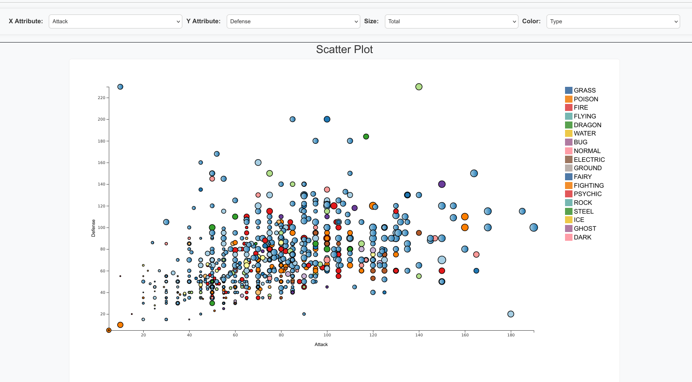
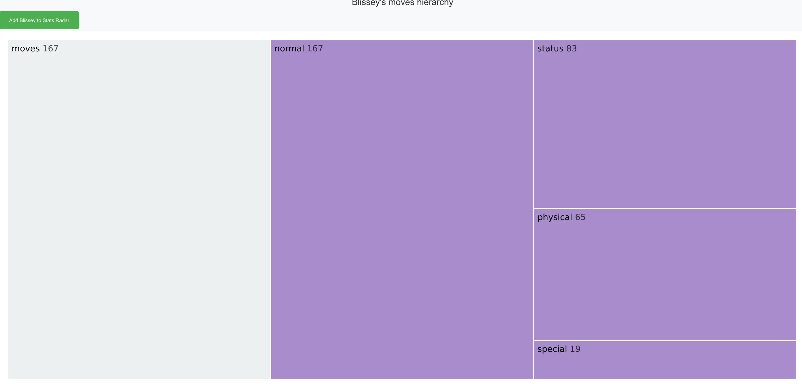
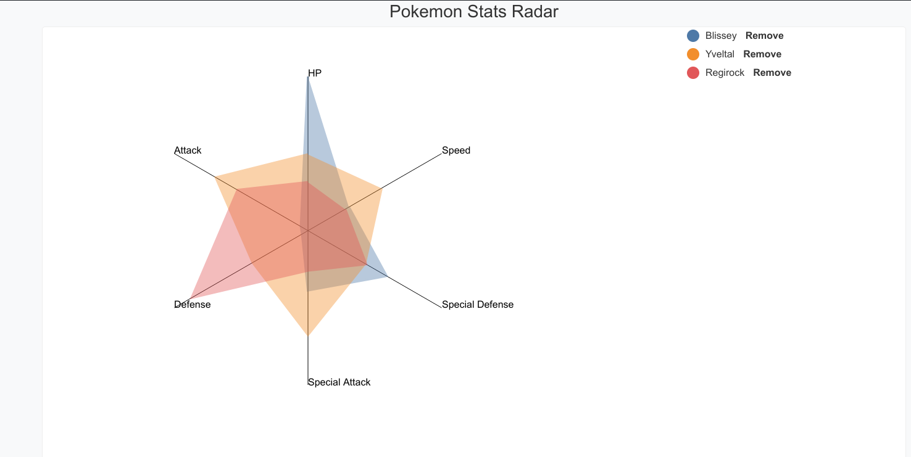
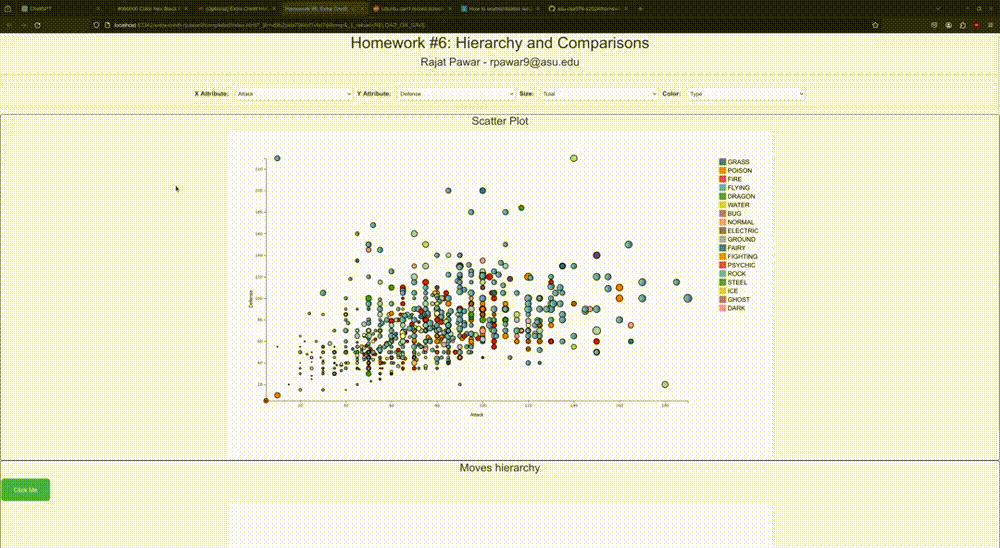

# Homework #6: D3 Hierarchies and Comparison

## Introduction

Welcome to the Pokémon Insights and Comparisons tool! This interactive visualization platform empowers users to explore
Pokémon data, unravel move hierarchies, and compare Pokémon attributes with ease.
In this homework, you'll apply knowledge about D3 Hierarchies and Comparison to create a linked scatter plot, animated
icicle
plot and radar plot. Icicle plot show hierarchy of attributes. Your Icicle
plot will be linked to the scatter plot via click interactions. That is, when a user click on a data points
in the scatter plot, the icicle plot will be drawn (or updated) using D3-based animations. Further, there will be a
button to add that data point to radar plot for comparison.

This assignment is worth 10 points. It will include the following aspects:

Create a page with a control panel to hold a set of required HTML controls and two visualization panels to hold your
scatter plot, icicle plot and radar plot.

Draw the Pokémon.csv dataset and attributes in the scatter plot.
When the user clicks on a point in the scatter plot, draw (or update) the icicle plot to show lineage
of moves of the selected point, utilise moves.csv.

User has an option to add the point to Radar Chart for comparison of various attributes including Attack, Defense,
Special Attack,
Special Defense, Speed, and HP.

We don't give you any starter code for this assignment: you'll have to create everything from scratch, excluding making
the index.html page. You have the freedom to stylize your chart (and webpage) as desired, though points will be deducted
for sloppy design (in other words, you should apply good principles of styling, UI, and UX design that we have been
teaching in lectures).

## Features

# Step 1: Create your initial page

Name your html file `index.html`. Create four panels on your page: one will be a control panel, one will hold the
scatter plot, one will hold the icicle plot, and one will hold radar plot. The exact layout and sizing is up to you, but
I recommend you make your overall page no wider than ~1400-1920 px. (It's fine if you have to scroll to see everything.)
At the top of the page,
add a title for the homework, your name, and an email (similar to prior homeworks).

For this assignment, you will store your CSS and Javascript code in their own files, naming the files with your ASURITE.
For example, I would name my files `cbryan16.css` and `cbryan16.js`, and link to them from my `index.html`.

## Step 2: Create your control panel and Import the Datasets

The control panel should have the following controls (though you can add additional controls if you want) with
appropriate labeling.
-**X Attribute**: A `select` that shows all quantitative attributes in the dataset. Picking an option here will update
the scatter plot's x-axis and data points accordingly.
- **Y Attribute**: A `select` that shows all quantitative attributes in the dataset. Picking an
  option here will update the scatter plot's y-axis plot accordingly.
- **Color**: A `select` that shows all categorical attributes in the dataset. Picking an option here
  will update the attribute used to color the data points in the scatter plot.
- **Size**: A `select` that shows all quantitative attributes in the dataset. The selected option
  here will be what is shown in the box plot.

### Step 3: Pokémon Scatter Symphony(

- **Draw a Scatter Plot**: Utilize "pokemon.csv" to create a dynamic scatter plot.
- **Configurable Axes**: Customize x and y axes with quantitative attributes.
- **Colorful Circles**: Pokémon types dictate circle colors, with multiple types blending hues.
- **Circle Size Points**: Size of circles varies based on quantitative attributes.
- **Hover Information**: Hover over circles to reveal Pokémon names.
- **User Feedback**: Selected points gain prominence with increased size, border additions, and contrast shifts.
- **Dynamic Axis Titles**: Axes adapt to selected attributes for seamless exploration.

### Step 4: Pokémon Moves Hierarchies

- **Icicle Plot**: Click on a data point to reveal a move hierarchy icicle plot of moves data utilize "moves.csv".
- **Pokémon Comparison**: Give user option to add Pokémon to the radar plot for easy attribute comparisons.
- **Hover Details**: Rectangles in the icicle plot unveil hierarchical lineage and frequency.

### Step 5: Pokémon Radar Revelations

- **Attribute Showcase**: Added Pokémon showcase stats on a radar chart, including Attack, Defense, Special Attack,
  Special Defense, Speed, and HP.
- **Legend and Removal**: A legend allows users to remove Pokémon from the radar plot for a clutter-free comparison
  experience.

### Step 6: Extra Credit Adventures

There are two ways you can potentially receive extra credit for this assignment. A maximum of 3 extra credit points can
be added to this assignment.

- **Transitions**: Seamless transitions enhance the scatter plot and radar plot user experience.When the user changes
  how attributes are shown in the scatter plot, instead of erasing and re-drawing the points, animate them from their
  old locations to new locations (likewise, animate the axis that is being updated, in parallel with the points). (+2)
- **Zoomable Icicle**: Zoomable transitions provide a detailed view of Pokémon move hierarchies.(+2)
